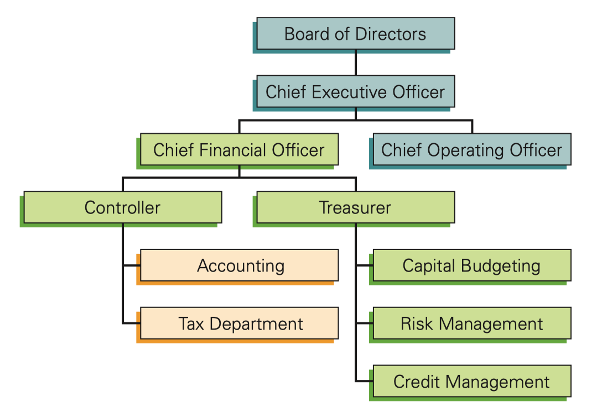

# 1. The Corporation
In 1819, the U.S. Supreme Court established the legal precedent, that the property of a corporation, like that of a person, is private, and entitled to protection under the U.S. Constitution.

Before this, the owners of a corporation were exposed to the possibility, that the state could take their business. This concern was real enough to stop most businesses from incorporating. 

Today, the corporate structure is ubiquitous all over the world, and yet continues to evolve in the face of new forces. In 2008 the financial crisis once again transformed the financial landscape, bringing down giants like Lehman Brothers, and reshaping investment banks like Goldman Sachs into government-guaranteed commercial banks. 

Government bailouts have provoked challenging questions, regarding the role of the federal government in the control and management of private corporations. In the wake of the crisis, significant reforms of the regulation, and oversight of financial markets were passed into law. 

## 1.1 The Four Types of Firms
The 4 major types of firms: 
- Sole proprietorships
- Partnerships
- Limited liability companies (LLC)
- Corporations

### Sole proprietorships
It is a business owned and run by one person. They are usually very small with a few employees. Although they do not account for much sales revenue in the economy, they are the most common type of firm in the world. 

Nearly 72% of businesses in the US are sole proprietorships, although they generate only 4% of the revenue. Contrast this with corporations, which make up under 18% of firms, but are responsible for 83% of US revenue. 

Key characteristics:
1. They are straightforward to set up. So many new businesses use this organizational form.
2. Its principal limitation is that, there is no separation between the firm and the owner - the firm can have only one owner. If there are other investors, they cannot hold an ownership stake in the firm.
3. The owner has *unlimited* personal liability for any of the firm's debts. So if the firm defaults on any debt payment, the lender can (and will) require the owner to repay the loan from personal assets. An owner who cannot afford to repay the loan must declare personal bankruptcy.
4. The life of a sole proprietorship is limited to the life of the owner. It is also difficult to transfer ownership of a sole proprietorship.

For most businesses, the disadvantages of a sole proprietorship outweigh the advantages. As soon as the firm reaches the point, at which it can borrow without the owner agreeing to be personally liable, the owners typically convert the business into a form, that limits the owner's liability.

### Partnerships
It is identical to a sole proprietorship, except it has more than one owner.

Key features:
1. All partners are liable for the firm's debt. 
2. The partnership ends on the death/withdrawal of any single partner, although partners can avoid liquidation, if the partnership agreement provides for alternatives, such as a buyout of a deceased/withdrawn partner.

Some old and established businesses remain partnerships, or sole proprietorships. Often, these firms are the types of businesses, in which the owners' personal reputations are the basis for the businesses. e.g., law firms, groups of doctors, and accounting firms. For such enterprises, the partners' personal liability increases the confidence of the firm's clients, that the partners will strive to maintain their reputation.

A limited partnership is a partnership with two kinds of owners: general partners, and limited partners. 
- General partners have the same rights and privileges as partners in a (general) partnership - they are personally liable for the firm's debt obligations. 
- Limited partners have limited liability - their liability is limited to their investment. Their private property cannot be seized to pay off the firm's outstanding debts. Furthermore, the death/withdrawal of a limited partner does not dissolve the partnership, and a limited partner's interest is transferable. However, a limited partner has no management authority, and cannot legally be involved in the managerial decision making for the business.

Private equity funds, and venture capital funds, are two examples of industries dominated by limited partnerships. 
- In these firms, a few general partners contribute some of their own capital, and raise additional capital from outside investors, who are limited partners. 
- The general partners control how all the capital is invested. Most often they will actively participate in running the businesses that they choose to invest in. 
- The outside investors play no active role in the partnership, other than monitoring how their investments are performing.

### Limited Liability Companies (LLC)
It is a limited partnership, without a general partner. So all the owners have limited liability, but unlike limited partners, they can also run the business.

The LLC is a relatively new phenomenon in the US (started in 1977 WY only).

### Corporations
A corporation is a legally defined, artificial being, separate from its owners. So it has many of the legal powers that people have. It can enter into contracts, acquire assets, incur obligations, and, it enjoys protection under the U.S. Constitution, against the seizure of its property. 

Because a corporation is a legal entity, separate and distinct from its owners, it is solely responsible for its own obligations. Consequently, the owners/employees/customers of a corporation are not liable for any obligations the corporation enters into. Similarly, the corporation is not liable for any personal obligations of its owners.

Corporations must be legally formed, which means that, the state in which it is incorporated must formally give its consent to the incorporation, by chartering it. Setting up a corporation is therefore considerably more costly, than setting up a sole proprietorship.

For jurisdictional purposes, a corporation is a citizen of the state in which it is incorporated. 

The corporate charter specifies the initial rules, that govern how the corporation is run.

There is no limit on the number of owners a corporation can have. Because most corporations have many owners, each owner owns only a small fraction of the corporation. The entire ownership stake of a corporation is divided into shares, known as stock.

The collection of all the outstanding shares of a corporation is known as the "equity" of the corporation. An owner of a share of stock in the corporation is known as a shareholder, stockholder, or equity holder, and is entitled to dividend payments, that is, payments made at the discretion of the corporation to its equity holders.

Shareholders usually receive a share of the dividend payments, that is proportional to the amount of stock they own. For example, a shareholder who owns 25% of the firm's shares will be entitled to 25% of the total dividend payment.

A unique feature of a corporation is that, there is no limitation on who can own its stock. That is, an owner of a corporation need not have any special expertise or qualification. This feature allows free trade in the shares of the corporation, and provides one of the most important advantages of organizing a firm as a corporation, rather than as sole proprietorship, partnership, or LLC. Corporations can raise substantial amounts of capital, because they can sell ownership shares to anonymous outside investors.

The availability of outside funding has enabled corporations to dominate the economy. 

### Tax Implications for Corporate entities
An important difference between the types of organizational forms, is the way they are taxed. Because a corporation is a separate legal entity, a corporation's profits are subject to taxation, separate from its owners' tax obligations. 

In effect, shareholders of a corporation pay taxes twice. First, the corporation pays tax on its profits, and then when the remaining profits are distributed to the shareholders, the shareholders pay their own personal income tax on this income. This system is sometimes referred to as `"double taxation"`.

For example, you are a shareholder in a corporation. The corporation earns $5 per share before taxes. After it has paid taxes, it will distribute the rest of its earnings to you as a dividend. The dividend is income to you, so you will then pay taxes on these earnings. 

`S Corporations`: The corporate organizational structure is the only organizational structure subject to double taxation. However, the U.S. Internal Revenue Code allows an exemption from double taxation for "S" corporations, which are corporations that elect `subchapter S tax treatment`.

Under these tax regulations, the firm's profits (and losses) are not subject to corporate taxes, but instead, are allocated directly to shareholders, based on their ownership share. The shareholders must include these profits as income on their individual tax returns (even if no money is distributed to them). However, after the shareholders have paid income taxes on these profits, no further tax is due.

Most countries offer investors in corporations some relief from double taxation. The United States offers partial relief, by having a lower tax rate on dividend income than on other sources of income. As of 2015, for most investors, qualified dividends are taxed at up to 20%, a rate significantly below their personal income tax rate. Despite this relief, the effective corporate tax rate in the U.S. is one of the highest in the world. 

The government places strict limitations on the qualifications for subchapter S tax treatment. In particular, the shareholders of such corporations must be individuals who are U.S. citizens or residents, and there can be no more than 100 of them. Because most corporations have no restrictions on who owns their shares, or the number of shareholders, they cannot qualify for subchapter S treatment. Thus most large corporations are `"C" corporations`, which are corporations subject to corporate taxes. S corporations account for less than 25% of all corporate revenue.

## 1.2 Ownership Versus Control of Corporations
It is often not feasible for the owners of a corporation to have direct control of the firm, because there are sometimes many owners, each of whom can freely trade their stock. That is, in a corporation, direct control and ownership are often separate. 

### The Corporate Management Team
Rather than the owners, the "board of directors", and "chief executive officer", possess direct control of the corporation. 

The shareholders of a corporation exercise their control, by electing a board of directors - a group of people who have the ultimate decision-making authority in the corporation.

In most corporations, each share of stock gives a shareholder 1 vote in the election of the board of directors, so investors with the most shares have the most influence. When one or two shareholders own a very large proportion of the outstanding stock, these shareholders may either be on the board of directors themselves, or they may have the right to appoint a number of directors.

The board of directors makes rules, on how the corporation should be run, how the top managers in the corporation are paid, sets policy, and monitors company performance. 

The board of directors delegates most decisions, that involve day-to-day running of the corporation, to its management. The chief executive officer (CEO) is charged with running the corporation by instituting the rules and policies set by the board of directors. The size of the rest of the management team varies from corporation to corporation. 

The separation of powers within corporations between the board of directors, and the CEO, is not always distinct. In fact, it is common for the CEO also to be the chairman of the board of directors. 

The most senior financial manager is the chief financial officer (CFO), who often reports directly to the CEO.

A typical organizational chart:

### The Financial Manager
Within the corporation, financial managers are responsible for: making investment/financing decisions, and managing the firm's cash flows.

Investment Decisions. It is the financial manager's most important job. They must weigh the costs and benefits of all investments and projects, and decide which of them qualify as good uses of the money stockholders have invested in the firm. These investment decisions fundamentally shape what the firm does, and whether it will add value for its owners. 

Financing Decisions. Once the financial manager has decided which investments to make, they also decide how to pay for them. Large investments may require the corporation to raise additional money. They must decide whether to raise more money from new/existing owners by selling more shares of stock (equity), or to borrow the money (debt). 

Cash Management. The financial manager must ensure that the firm has enough cash on hand, to meet its day-to-day obligations - managing working capital. It may seem straightforward, but in a young or growing company, it can mean the difference between success and failure. Even companies with great products require significant amounts of money to develop, and bring those products to market. A company typically burns through a significant amount of cash developing a new product, before its sales generate income. 

### The goal of the Firm
In theory, the goal of a firm should be determined by the firm's owners. But in organizational forms with multiple owners, the appropriate goal of the firm is not as clear.

Many corporations have thousands of owners (shareholders). The interests of shareholders are aligned for many important decisions. That is because, regardless of their own personal financial position and stage in life, all the shareholders will agree that they are better off, if management makes decisions that increase the value of their shares.

### The Firm and Society
Are decisions that increase the value of the firm's equity beneficial for society as a whole? Most often they are.

The problem occurs when increasing the value of equity comes at the expense of others. Consider a corporation that, in the course of business, pollutes the environment, and does not pay the costs to clean up the pollution. In such cases, decisions that increase shareholder wealth can be costly for society as whole.

The 2008 financial crisis highlighted another example of decisions that can increase shareholder wealth but are costly for society. In the early part of the last decade, banks took on excessive risk. For a while, this strategy benefited the banks' shareholders. But when the bets went bad, the resulting financial crisis harmed the broader economy.

When the actions of the corporation impose harm on others in the economy, appropriate public policy and regulation is required, to assure that corporate interests and societal interests remain aligned. Sound public policy should allow firms to continue to pursue the maximization of shareholder value, in a way that benefits society overall.

### Ethics and Incentives within Corporations
A corporation is run by a management team, separate from its owners, giving rise to conflicts of interest. How can the owners of a corporation ensure that the management team will implement their goals?

The agency problem: when managers, despite being hired as the agents of shareholders, put their own self-interest ahead of the interests of shareholders. Managers face the ethical dilemma of whether to adhere to their responsibility to put the interests of shareholders first, or to do what is in their own personal best interest.

This problem is commonly addressed in practice, by minimizing the number of decisions managers must make, for which their own self-interest substantially differs from the interests of the shareholders. For example, managers' compensation contracts are designed to ensure that most decisions in the shareholders' interest are also in the managers' interests; shareholders often tie the compensation of top managers to the corporation's profits, or to its stock price.

There is, however, a limitation to this strategy. By tying compensation too closely to performance, the shareholders might be asking managers to take on more risk than they are comfortable taking. As a result, managers may not make decisions that the shareholders want them to, or it might be hard to find talented managers willing to accept the job. On the other hand, if compensation contracts reduce managers' risk, by rewarding good performance, but limiting the penalty associated with poor performance, managers may have an incentive to take excessive risk.

Further potential for conflicts of interest and ethical considerations arise, when some stakeholders in the corporation benefit, and others lose from a decision. Shareholders and managers are two types of stakeholders in the corporation, but others include the regular employees, and the communities in which the company operates, etc. 

Managers may decide to take the interests of other stakeholders into account in their decisions, such as keeping a loss-generating factory open, because it is the main provider of jobs in a small town, paying above-market wages to factory workers in a developing country, or operating a plant at a higher environmental standard than local law mandates.

In some cases, these actions that benefit other stakeholders also benefit the firm's shareholders, by creating a more dedicated workforce, generating positive publicity with customers, or other indirect effects. In other instances, when these decisions benefit other stakeholders at shareholders' expense, they represent a form of "corporate charity". Indeed, many if not most corporations explicitly donate (on behalf of their shareholders) to local and global charitable and political causes. 

For example, in 2013, Walmart gave $312 million in cash to charity (making it the largest corporate donor of cash in that year). These actions are costly and reduce shareholder wealth. Thus, while some shareholders might support such policies because they feel that they reflect their own moral and ethical priorities, it is unlikely that all shareholders will feel this way, leading to potential conflicts of interest amongst shareholders.

The CEO's Performance. Another way shareholders can encourage managers to work in the interests of shareholders, is to discipline them if they don't. If shareholders are unhappy with a CEO's performance, they could, in principle, pressure the board to oust the CEO.

Despite these high-profile examples, directors and top executives are rarely replaced through a grassroots shareholder uprising. Instead, dissatisfied investors often choose to sell their shares. 

If enough shareholders are dissatisfied, the only way to entice investors to buy (or hold on to) the shares is to offer them a low price. Similarly, investors who see a well-managed corporation will want to purchase shares, which drives the stock price up. Thus, the stock price of the corporation is a barometer for corporate leaders, that continuously gives them feedback on their shareholders' opinion of their performance.

When the stock performs poorly, the board of directors might react by replacing the CEO. In some corporations, however, the senior executives are entrenched, because boards of directors do not have the will to replace them - often, the reluctance to fire is because the board members are close friends of the CEO, and lack objectivity.

In corporations in which the CEO is entrenched and doing a poor job, the expectation of continued poor performance will decrease the stock price. Low stock prices create a profit opportunity. 

In a "hostile" takeover, an individual or organization, sometimes known as a "corporate raider", can purchase a large fraction of the stock, and acquire enough votes to replace the board of directors and the CEO. With a new superior management team, the stock is a much more attractive investment, which would likely result in a price rise, and a profit for the corporate raider and the other shareholders.

Although the words "hostile" and "raider" have negative connotations, corporate raiders themselves provide an important service to shareholders. The mere threat of being removed as a result of a hostile takeover, is often enough to discipline bad managers, and motivate boards of directors to make difficult decisions. Consequently, when a corporation's shares are publicly traded, a "market for corporate control" is created, that encourages managers and boards of directors to act in the interests of their shareholders.

Corporate bankruptcy. Ordinarily, a corporation is run on behalf of its shareholders. But when a corporation borrows money, the firm's debt holders also become investors in the corporation. While the debt holders do not normally exercise control over the firm, if the corporation fails to repay its debts, the debt holders are entitled to seize the assets of the corporation, in compensation for the default.

To prevent such a seizure, the firm may attempt to renegotiate with the debt holders, or file for bankruptcy protection in a federal court. Ultimately, however, if the firm is unable to repay or renegotiate with the debt holders, the control of the corporation's assets will be transferred to them.

Thus, when a firm fails to repay its debts, the end result is a change in ownership of the firm, with its control being passed from equity holders to debt holders. Importantly, bankruptcy need not result in a liquidation of the firm, which involves shutting down the business and selling off its assets. Even if control of the firm passes to the debt holders, it is in the debt holders' interest to run the firm in the most profitable way possible. Doing so often means keeping the business operating.

Thus, a corporate bankruptcy is best thought of as a change in ownership of the corporation, and not necessarily as a failure of the underlying business.

## 1.3 The Stock Market
Because private companies have a limited set of shareholders, and their shares are not regularly traded, the value of their shares can be difficult to determine. But many corporations are public companies, whose shares trade on organized markets, called a stock market (or stock exchange).

These markets provide liquidity, and determine a market price for the company's shares. An investment is liquid, if it is possible to sell it quickly and easily, for a price very close to the price at which you could contemporaneously buy it. 

This liquidity is attractive to outside investors, as it provides flexibility regarding the timing and duration of their investment in the firm. In addition, the research and trading of participants in these markets give rise to share prices, that provide constant feedback to managers regarding investors' views of their decisions.

### Primary and Secondary Stock Markets
When a corporation itself issues new shares of stock, and sells them to investors, it does so on the primary market. After this initial transaction between the corporation and investors, the shares continue to trade in a secondary market, between investors, without the involvement of the corporation. 

For example, if you wish to buy 100 shares of Starbucks Coffee, you would place an order on a stock exchange, where Starbucks trades under the ticker symbol SBUX. You would buy your shares from someone who already held shares of Starbucks, not from Starbucks itself. Because firms only occasionally issue new shares, secondary market trading accounts for the vast majority of trading in the stock market.

### Traditional Trading Venues
Historically, a firm would choose one stock exchange on which to list its stock, and almost all trade in the stock would occur on that exchange. In the U.S., the two most important exchanges are the New York Stock Exchange (NYSE), and the National Association of Security Dealers Automated Quotation (NASDAQ).

Prior to 2005, almost all trade on the NYSE took place on the exchange's trading floor in lower Manhattan. Market makers (known then on the NYSE as specialists) matched buyers and sellers. They posted two prices for every stock in which they made a market: the price at which they were willing to buy the stock (the bid price), and the price at which they were willing to sell the stock (the ask price). When a customer arrived and wanted to make a trade at these prices, the market maker would honor the posted prices (up to a limited number of shares) and make the trade even when they did not have another customer willing to take the other side of the trade. In this way, market makers provided liquidity by ensuring that market participants always had somebody to trade with.

In contrast to the NYSE, the NASDAQ market never had a trading floor. Instead, all trades were completed over the phone or on a computer network. An important difference between the NYSE and NASDAQ was that on the NYSE, each stock had only one market maker. On the NASDAQ, stocks had multiple market makers who competed with one another. Each market maker posted bid and ask prices on the NASDAQ network that were viewed by all participants.

Market makers make money because ask prices are higher than bid prices. This difference is called the bid-ask spread. Customers always buy at the ask (the higher price) and sell at the bid (the lower price). The bid-ask spread is a transaction cost investors pay in order to trade. Because specialists on the NYSE took the other side of the trade from their customers, this cost accrued to them as a profit. This was the compensation they earned for providing a liquid market by standing ready to honor any quoted price. Investors also paid other forms of transactions costs like commissions.

### New Competition and Market Changes
Stock markets have gone through enormous changes in the last decade. In 2005, the NYSE and NASDAQ exchanges accounted for over 75% of all trade in U.S. stocks. Since that time, however, they have faced increasing competition from new fully electronic exchanges, as well as alternative trading systems. Today, these new entrants handle more than 50% of all trades. 

With this change in market structure, the role of an official market maker has largely disappeared. Because all transactions occur electronically with computers matching buy and sell orders, anyone can make a market in a stock by posting a limit order - an order to buy or sell a set amount at a fixed price. 

For example, a limit buy order might be an order to buy 100 shares of IBM at a price of $138/share. The bid-ask spread of a stock is determined by the outstanding limit orders. The limit sell order with the lowest price is the ask price. The limit buy order with the highest price is the bid price. Traders make the market in the stock by posting limit buy and sell orders. 

The collection of all limit orders is known as the limit order book. Exchanges make their limit order books public, so that investors (or their brokers) can see the best bid and ask prices when deciding where to trade.

When news about a stock arrives that causes the price of that stock to move, smart traders will quickly take advantage of the existing limit orders by executing trades at the old prices. To protect themselves against this possibility, liquidity providers need to constantly monitor the market, cancelling old orders and posting new orders when appropriate. 

So-called high frequency traders (HFTs) are a class of traders who, with the aid of computers, will place, update, cancel, and execute trades many times per second in response to new information as well as other orders, profiting both by providing liquidity and by taking advantage of stale limit orders.

### Dark Pools
When trading on an exchange, investors are guaranteed the opportunity to trade immediately at the current bid or ask price, and transactions are visible to all traders when they occur. In contrast, alternative trading systems called dark pools do not make their limit order books visible. Instead, these dark pools offer investors the ability to trade at a better price (for example, the average of the bid and ask, thus saving the bid-ask spread), with the tradeoff being that the order might not be filled if an excess of either buy or sell orders is received. Trading on a dark pool is therefore attractive to traders who do not want to reveal their demand and who are willing to sacrifice the guarantee of immediacy for a potentially better price.

## Appendix: Other Notes
Goldman Sachs discussion on converting from a partnership to a corporation:
- Public corporation: 
  - Offers greater financial and strategic flexibility, for aggressive growth
  - Has a more stable equity base, to support growth and disperse risk. 
  - Increased access to large public debt markets
  - Publicly trade securities, to do acquisitions, motivate employees, etc
  - Simpler/transparent structure, to increase scale and global reach
- Partnership:
  - Generate capital internally, fund growth in the private placement markets
  - Have long-term view of returns with investment, with less focus on earning volatility, which is not valued in public companies
  - Retain voting control and alignment of the partners and the firm. 

What drove the conversion:
- To secure permanent capital to grow
- To be able to use publicly traded securities, to finance acquisitions;
- To enhance the culture of ownership, and gain compensation flexibility.
